### Command: git config --global user.name

**Syntax**
git config --global user.name "Your Name"

**Purpose**
Sets the global username used in Git commits.

**Example**
git config --global user.name "Lokeshwar Reddy"

**Screenshot**
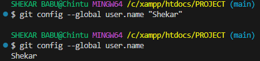

### Command: git config --global user.email

**Syntax**
git config --global user.email "your-email@example.com"

**Purpose**
Sets the global email used in Git commits.

**Example**
git config --global user.email "lokesh@example.com"

**Screenshot**
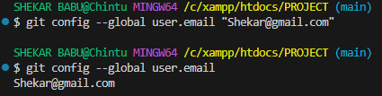

### Command: git config --list

**Syntax**
git config --list

**Purpose**
Displays all Git configuration settings.

**Example**
git config --list

**Screenshot**
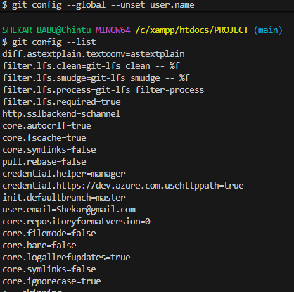

### Command: git config --unset

**Syntax**
git config --global --unset user.email

**Purpose**
Removes a specific Git configuration setting.

**Example**
git config --global --unset user.email

**Screenshot**

### Command: git init

**Syntax**
git init

**Purpose**
Initializes a new Git repository in an existing directory.

**Example**
git init

**Screenshot**
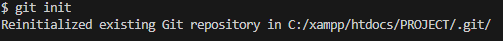

### Command: git clone

**Syntax**
git clone <repository-url>

**Purpose**
Creates a local copy of a remote repository.

**Example**
git clone https://github.com/username/git-industry-practice.git

**Screenshot**

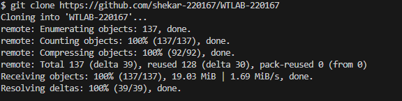

### Command: git clone --branch

**Syntax**
git clone --branch <branch-name> <repository-url>

**Purpose**
Clones a specific branch from a repository.

**Example**
git clone --branch feature-demo https://github.com/username/git-industry-practice.git

**Screenshot**

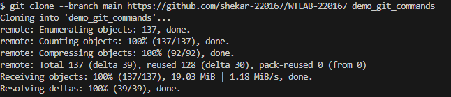

### Command: git clone --depth

**Syntax**
git clone --depth <number> <repository-url>

**Purpose**
Clones a repository with limited commit history.

**Example**
git clone --depth 1 https://github.com/username/git-industry-practice.git

**Screenshot**

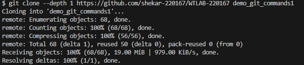

### Command: git status

**Syntax**
git status

**Purpose**
Displays the state of the working directory and staging area.

**Example**
git status

**Screenshot**

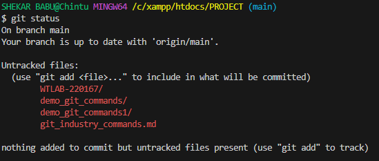

### Command: git log

**Syntax**
git log

**Purpose**
Displays the complete commit history of the repository including commit ID, author, date, and message.

**Example**
git log

**Screenshot**

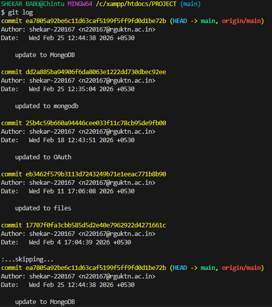

### Command: git log --oneline

**Syntax**
git log --oneline

**Purpose**
Shows a compact version of the commit history where each commit appears in a single line.

**Example**
git log --oneline

**Screenshot**

### Command: git log --graph --oneline

**Syntax**
git log --graph --oneline

**Purpose**
Displays the commit history with a graphical representation of branch and merge structure.

**Example**
git log --graph --oneline

**Screenshot**

### Command: git show

**Syntax**
git show

**Purpose**
Displays detailed information about the latest commit including the changes introduced in that commit.

**Example**
git show

**Screenshot**

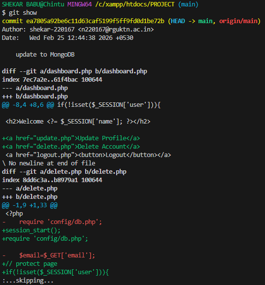

### Command: git diff

**Syntax**
git diff

**Purpose**
Shows the differences between the working directory and the staging area.

**Example**
git diff

**Screenshot**

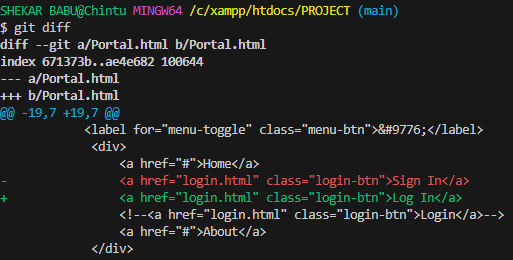

### Command: git diff --staged

**Syntax**
git diff --staged

**Purpose**
Displays the changes that have been staged for the next commit.

**Example**
git diff --staged

**Screenshot**

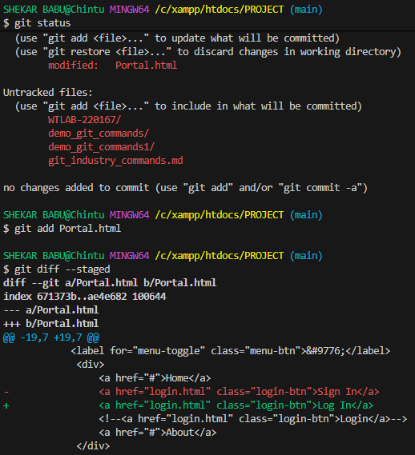

### Command: git blame

**Syntax**
git blame <file-name>

**Purpose**
Shows who last modified each line of a file along with the commit information.

**Example**
git blame file1.txt

**Screenshot**

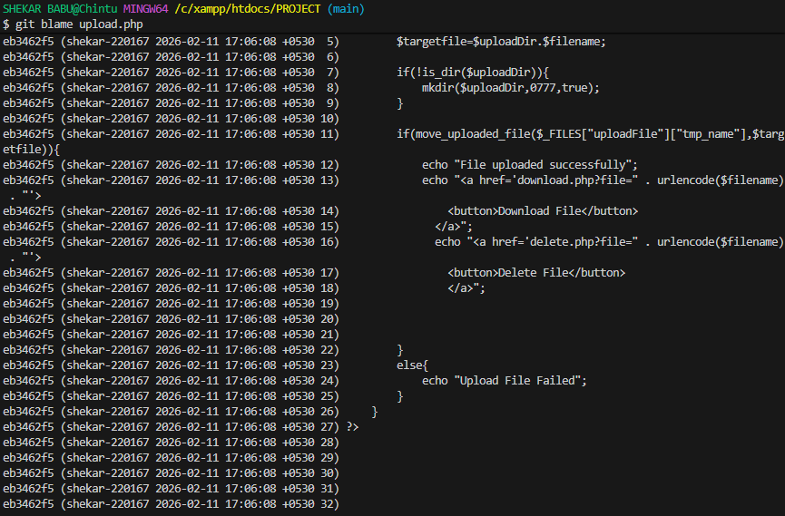

### Command: git reflog

**Syntax**
git reflog

**Purpose**
Displays the history of all HEAD movements such as commits, checkouts, resets, and rebases.

**Example**
git reflog

**Screenshot**

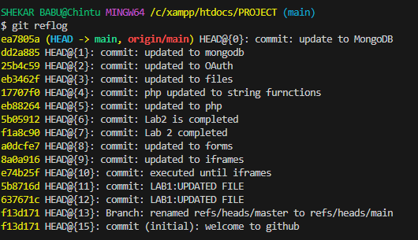

### Command: git shortlog

**Syntax**
git shortlog

**Purpose**
Summarizes commit history grouped by author showing the number of commits made by each contributor.

**Example**
git shortlog

**Screenshot**

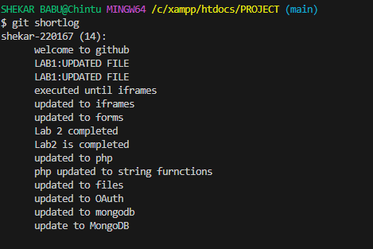

### Command: git add

**Syntax**
git add <file-name>

**Purpose**
Adds a specific file from the working directory to the staging area so it can be included in the next commit.

**Example**
git add file1.txt

**Screenshot**

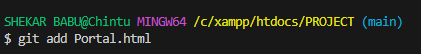

### Command: git add .

**Syntax**
git add .

**Purpose**
Stages all modified and new files in the current directory and its subdirectories for commit.

**Example**
git add .

**Screenshot**

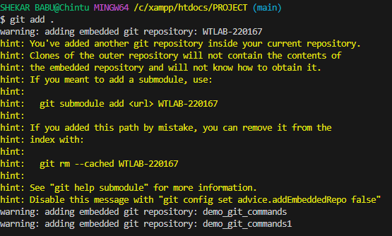

### Command: git add -p

**Syntax**
git add -p

**Purpose**
Allows interactive staging of changes by selecting specific parts of a file instead of staging the entire file.

**Example**
git add -p

**Screenshot**

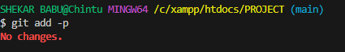

### Command: git restore

**Syntax**
git restore <file-name>

**Purpose**
Restores a file in the working directory to its last committed state, discarding local modifications.

**Example**
git restore file1.txt

**Screenshot**

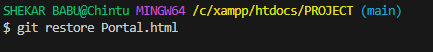

### Command: git restore --staged

**Syntax**
git restore --staged <file-name>

**Purpose**
Removes a file from the staging area without deleting the changes from the working directory.

**Example**
git restore --staged file1.txt

**Screenshot**

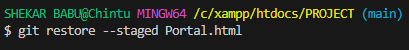

### Command: git rm

**Syntax**
git rm <file-name>

**Purpose**
Removes a file from the working directory and the repository and stages the deletion for commit.

**Example**
git rm test.txt

**Screenshot**

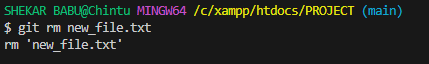

### Command: git mv

**Syntax**
git mv <old-file-name> <new-file-name>

**Purpose**
Renames or moves a file while keeping the change tracked by Git.

**Example**
git mv file2.txt renamed-file2.txt

**Screenshot**

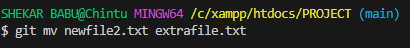

### Command: git commit

**Syntax**
git commit

**Purpose**
Creates a commit from the staged changes. Git opens the default editor to enter the commit message.

**Example**
git commit

**Screenshot**

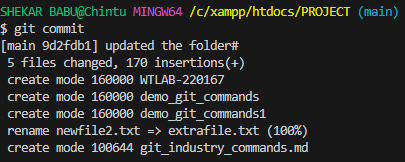

### Command: git commit -m

**Syntax**
git commit -m "commit message"

**Purpose**
Creates a commit with a message provided directly in the command line without opening an editor.

**Example**
git commit -m "added change for commit -m example"

**Screenshot**

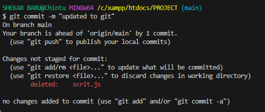

### Command: git commit --amend

**Syntax**
git commit --amend -m "new commit message"

**Purpose**
Modifies the most recent commit by changing its message or adding additional staged changes.

**Example**
git commit --amend -m "updated previous commit using amend"

**Screenshot**

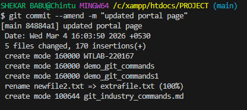

### Command: git commit --no-edit

**Syntax**
git commit --amend --no-edit

**Purpose**
Amends the most recent commit without changing the existing commit message.

**Example**
git commit --amend --no-edit

**Screenshot**

### Command: git branch

**Syntax**
git branch

**Purpose**
Lists all local branches in the repository and indicates the currently active branch.

**Example**
git branch

**Screenshot**

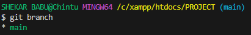

### Command: git branch -a

**Syntax**
git branch -a

**Purpose**
Displays all local and remote branches available in the repository.

**Example**
git branch -a

**Screenshot**

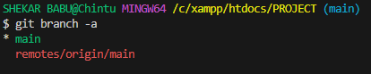

### Command: git checkout

**Syntax**
git checkout <branch-name>

**Purpose**
Switches the working directory to the specified branch.

**Example**
git checkout main

**Screenshot**

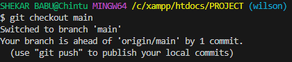

### Command: git checkout -b

**Syntax**
git checkout -b <new-branch-name>

**Purpose**
Creates a new branch and immediately switches to it.

**Example**
git checkout -b branch-demo

**Screenshot**

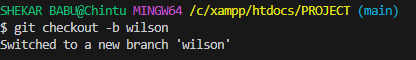

### Command: git switch

**Syntax**
git switch <branch-name>

**Purpose**
Switches the working directory to the specified branch using the modern Git command.

**Example**
git switch main

**Screenshot**

### Command: git branch -d

**Syntax**
git branch -d <branch-name>

**Purpose**
Deletes a branch that has already been merged into the current branch.

**Example**
git branch -d branch-demo

**Screenshot**

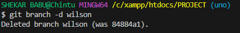

### Command: git branch -D

**Syntax**
git branch -D <branch-name>

**Purpose**
Force deletes a branch even if it has unmerged changes.

**Example**
git branch -D temp-branch

**Screenshot**

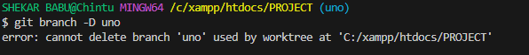

### Command: git merge

**Syntax**
git merge <branch-name>

**Purpose**
Combines changes from the specified branch into the current branch.

**Example**
git merge merge-demo

**Screenshot**

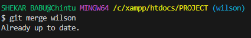

### Command: git merge --no-ff

**Syntax**
git merge --no-ff <branch-name>

**Purpose**
Merges a branch into the current branch while forcing Git to create a merge commit, preserving branch history.

**Example**
git merge --no-ff noff-demo

**Screenshot**

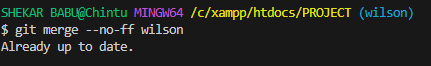

### Command: git remote

**Syntax**
git remote

**Purpose**
Lists the remote repository names associated with the local repository.

**Example**
git remote

**Screenshot**

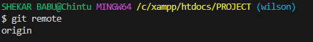

### Command: git remote -v

**Syntax**
git remote -v

**Purpose**
Displays the remote repository URLs used for fetching and pushing.

**Example**
git remote -v

**Screenshot**

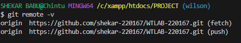

### Command: git remote add

**Syntax**
git remote add <name> <repository-url>

**Purpose**
Adds a new remote repository connection to the local repository.

**Example**
git remote add backup https://github.com/Lokesh-N220977/git-demo-practice.git

**Screenshot**

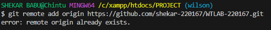

### Command: git remote remove

**Syntax**
git remote remove <remote-name>

**Purpose**
Removes a remote repository connection from the local repository.

**Example**
git remote remove backup

**Screenshot**

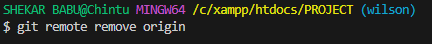

### Command: git fetch

**Syntax**
git fetch

**Purpose**
Downloads changes from the remote repository without merging them into the local branch.

**Example**
git fetch

**Screenshot**

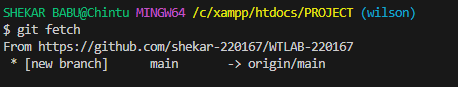

### Command: git fetch --all

**Syntax**
git fetch --all

**Purpose**
Fetches updates from all configured remote repositories.

**Example**
git fetch --all

**Screenshot**

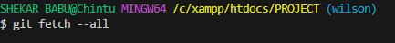

### Command: git pull

**Syntax**
git pull

**Purpose**
Fetches changes from the remote repository and merges them into the current branch.

**Example**
git pull

**Screenshot**

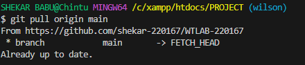

### Command: git pull --rebase

**Syntax**
git pull --rebase

**Purpose**
Fetches remote changes and reapplies local commits on top of them using rebase instead of merge.

**Example**
git pull --rebase

**Screenshot**

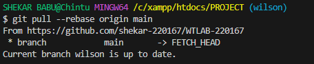

### Command: git push

**Syntax**
git push

**Purpose**
Uploads local commits to the remote repository.

**Example**
git push

**Screenshot**

### Command: git push -u origin branch-name

**Syntax**
git push -u origin <branch-name>

**Purpose**
Pushes a branch to the remote repository and sets the upstream tracking relationship.

**Example**
git push -u origin feature-demo

**Screenshot**

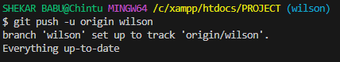

### Command: git push --force

**Syntax**
git push --force

**Purpose**
Forcefully updates the remote branch by overwriting its commit history with the local branch history.

**Example**
git push --force

**Screenshot**

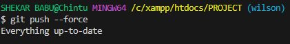

### Command: git stash

**Syntax**
git stash

**Purpose**
Temporarily saves uncommitted changes and reverts the working directory to the last committed state.

**Example**
git stash

**Screenshot**

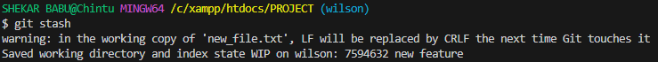

### Command: git stash list

**Syntax**
git stash list

**Purpose**
Displays all saved stash entries.

**Example**
git stash list

**Screenshot**

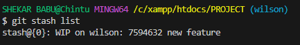

### Command: git stash apply

**Syntax**
git stash apply

**Purpose**
Applies the most recent stash changes to the working directory without removing them from the stash list.

**Example**
git stash apply

**Screenshot**

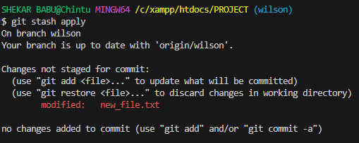

### Command: git stash pop

**Syntax**
git stash pop

**Purpose**
Applies the most recent stash to the working directory and removes it from the stash list.

**Example**
git stash pop

**Screenshot**

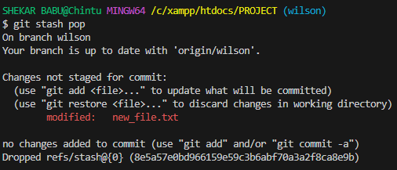

### Command: git stash drop

**Syntax**
git stash drop

**Purpose**
Deletes a specific stash entry from the stash list.

**Example**
git stash drop

**Screenshot**

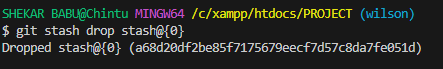

### Command: git stash clear

**Syntax**
git stash clear

**Purpose**
Removes all saved stashes from the repository.

**Example**
git stash clear

**Screenshot**

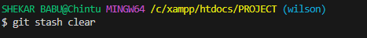

### Command: git reset

**Syntax**
git reset <commit>

**Purpose**
Moves the current branch pointer to a specified commit while keeping the changes in the working directory.

**Example**
git reset HEAD~1

**Screenshot**

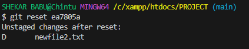

### Command: git reset --soft

**Syntax**
git reset --soft <commit>

**Purpose**
Moves HEAD to a previous commit while keeping all changes staged in the index.

**Example**
git reset --soft HEAD~1

**Screenshot**

### Command: git reset --mixed

**Syntax**
git reset --mixed <commit>

**Purpose**
Moves HEAD to a previous commit and keeps the changes in the working directory but removes them from the staging area.

**Example**
git reset --mixed HEAD~1

**Screenshot**

### Command: git reset --hard

**Syntax**
git reset --hard <commit>

**Purpose**
Moves HEAD to a previous commit and permanently discards all changes in the working directory and staging area.

**Example**
git reset --hard HEAD~1

**Screenshot**

### Command: git rebase

**Syntax**
git rebase <branch-name>

**Purpose**
Reapplies commits from the current branch on top of another branch, creating a linear history.

**Example**
git rebase main

**Screenshot**

### Command: git rebase -i

**Syntax**
git rebase -i <commit>

**Purpose**
Performs an interactive rebase allowing modification, reordering, or squashing of commits.

**Example**
git rebase -i HEAD~2

**Screenshot**

### Command: git rebase --continue

**Syntax**
git rebase --continue

**Purpose**
Continues the rebase process after resolving conflicts.

**Example**
git rebase --continue

**Screenshot**

### Command: git rebase --abort

**Syntax**
git rebase --abort

**Purpose**
Cancels the ongoing rebase process and restores the repository to its previous state.

**Example**
git rebase --abort

**Screenshot**

### Command: git cherry-pick

**Syntax**
git cherry-pick <commit-id>

**Purpose**
Applies a specific commit from another branch onto the current branch.

**Example**
git cherry-pick a1b2c3d

**Screenshot**

### Command: git format-patch

**Syntax**
git format-patch <number-of-commits>

**Purpose**
Generates patch files from commits that can be shared and applied elsewhere.

**Example**
git format-patch -1

**Screenshot**

### Command: git apply

**Syntax**
git apply <patch-file>

**Purpose**
Applies changes from a patch file to the working directory without creating a commit.

**Example**
git apply 0001-cherry-pick-commit.patch

**Screenshot**

### Command: git am

**Syntax**
git am <patch-file>

**Purpose**
Applies a patch file and automatically creates a commit from it.

**Example**
git am 0001-cherry-pick-commit.patch

**Screenshot**

### Command: git tag

**Syntax**
git tag

**Purpose**
Lists all tags in the repository.

**Example**
git tag

**Screenshot**

### Command: git tag -a

**Syntax**
git tag -a <tag-name> -m "message"

**Purpose**
Creates an annotated tag with additional information like message, author, and date.

**Example**
git tag -a v1.0 -m "version 1.0 release"

**Screenshot**

### Command: git tag -d

**Syntax**
git tag -d <tag-name>

**Purpose**
Deletes a tag from the local repository.

**Example**
git tag -d v1.0

**Screenshot**

### Command: git push origin --tags

**Syntax**
git push origin --tags

**Purpose**
Pushes all local tags to the remote repository.

**Example**
git push origin --tags

**Screenshot**

### Command: git submodule add

**Syntax**
git submodule add <repository-url> <folder-name>

**Purpose**
Adds an external Git repository as a submodule inside the current repository.

**Example**
git submodule add https://github.com/Lokesh-N220977/git-demo-practice.git submodule-demo

**Screenshot**

### Command: git submodule add

**Syntax**
git submodule add <repository-url> <folder-name>

**Purpose**
Adds an external Git repository as a submodule inside the current repository.

**Example**
git submodule add https://github.com/Lokesh-N220977/git-demo-practice.git submodule-demo

**Screenshot**

### Command: git submodule init

**Syntax**
git submodule init

**Purpose**
Initializes the submodule configuration by setting up the necessary metadata.

**Example**
git submodule init

**Screenshot**

### Command: git submodule update

**Syntax**
git submodule update

**Purpose**
Fetches and updates the submodule content to match the recorded commit.

**Example**
git submodule update

**Screenshot**

### Command: git bisect start

**Syntax**
git bisect start

**Purpose**
Starts the binary search process to find the commit that introduced a bug.

**Example**
git bisect start

**Screenshot**

### Command: git bisect bad

**Syntax**
git bisect bad

**Purpose**
Marks the current commit as containing the bug.

**Example**
git bisect bad

**Screenshot**

### Command: git bisect good

**Syntax**
git bisect good <commit-id>

**Purpose**
Marks a specific commit as good and helps Git narrow down the search for the faulty commit.

**Example**
git bisect good a1b2c3d

**Screenshot**

